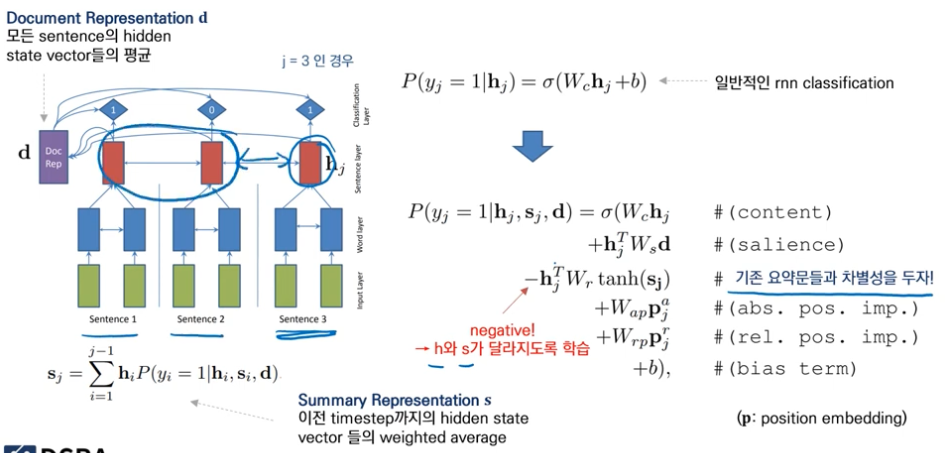
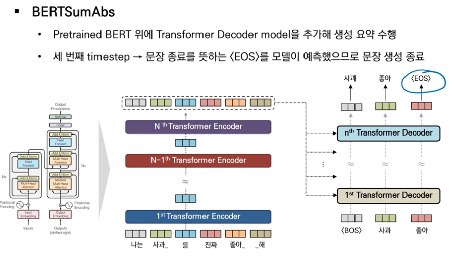

# Extractive Summary

## SummaRuNNer (2016)
- saliency와 novelty 에 대해 학습하는 방법을 제안함.  
 

## NeusSum(2018) -> sentence selection
- 소스 문장 중 요약문에 포함할 문장을 시간 순서대로 예측함.
- 예측할 문장 다음 순서로 선택될 문장을 고르기 위해 센텐스에 대해 스코어링을 진행함
- 로스를 계산할 때 바이너리가 아니라 rouge socre의 변화량을 label을 설정함.

# Abstractive Summary

## Pointer Generator
- 모든 단어 후보군 중에서 선택함
- source에 등장한 모든 단어와의 관계를 고려
- contribution : attention distribution을 prediction 에도 활용함 -> 단어를 예측할 때 source x 단어를 예측할 방법까지 사용함

## Bottom-up Attention
- 요약문 생성 전 원본 문서의 단어를 마스킹하는 content selection을 먼저 수행함 (추출 요약과 비슷하게 단어별 바이너리 분류)
- 정답 라벨은 정답 요약 문장의 subsequence를 자체적으로 생성 -> 가장 긴 문장을 선택해 레이블을 1로 함
  : subsequence는 계속 길수록 업데이트됨. ex) word vs long word -> long word를 선택함
- content selection에서 선택되지 않은 단어는 copy distribution에서 제외됨.
- 미사여구 등 원본 문장이 통째로 사용되는 걸 예방할 수 있음

## BERTSum
- BERT 이후 NLP의 변화
  - Transformer Encoder를 여러 층 쌓아올린게 BERT 모델임
  - Encoder에 학습한 후 다운스트림 태스크를 수행함.
- Extraction
  - 문장의 시작마다 CLS를 넣어서 인풋을 이루는 개별 문장마다 분류를 수행함
  - BERT를 거쳐 나온 output wnd CLS 토큰에 해당하는 vector만 선택함.
- Abstractive
  - Transformer Decoder : K, V는 인코더 인풋을, Q는 디코더 인풋을 사용함
  - 디코더를 추가해 생성 요약을 수행함
  - 
  - 디코더는 처음부터 학습을 해야함
  - 파인튜닝 과정에서 불균형이 생길 수 있어서 따로 수행함
- 결합
  - Extractive -> abstractive 순으로 수행함.
- 데이터셋 관련 설명
  - CNNDM은 원본 문서에 등장하지않은 새로운 단어가 적게 등장
  - XSUM은 짧지만 거의 새로운 단어로만 요약을 작성해 굉장히 abstractive함
  